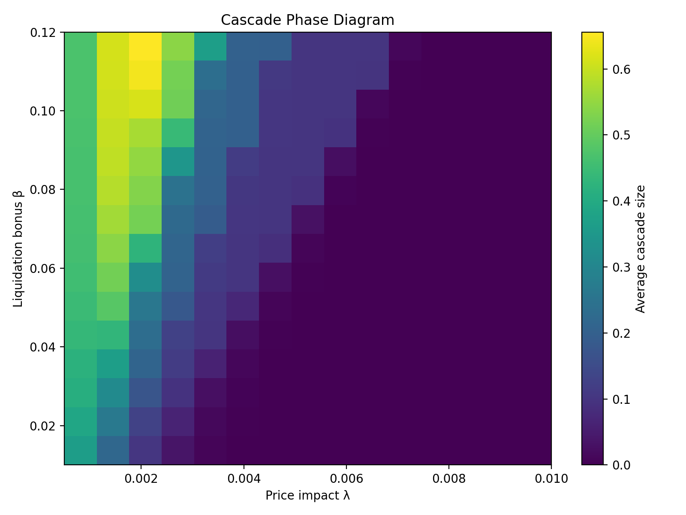
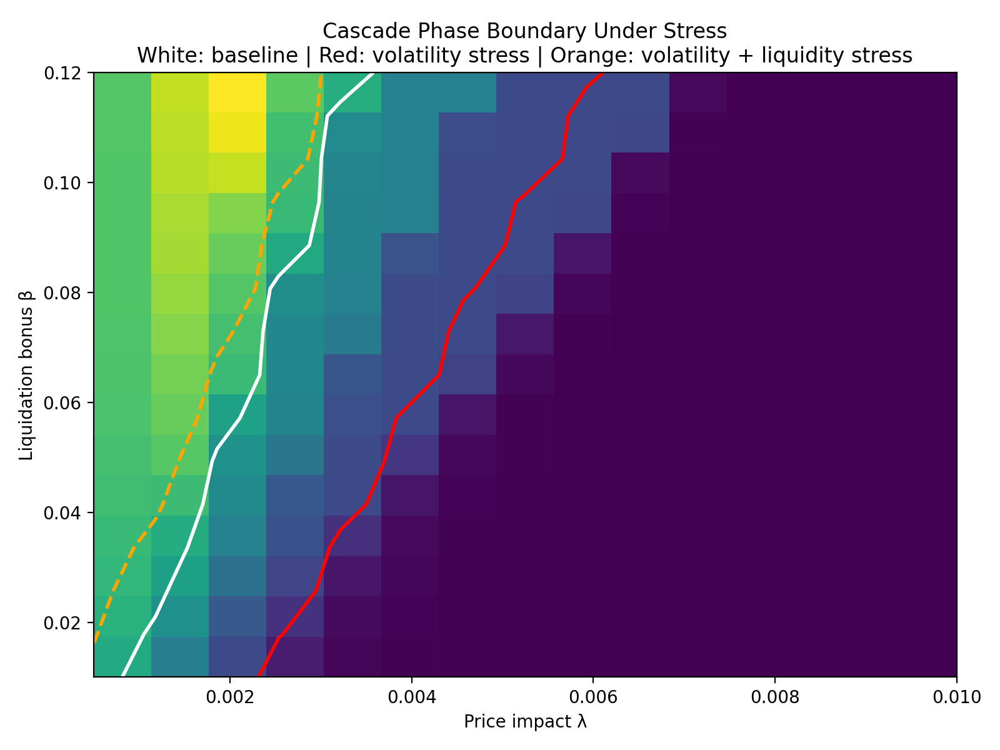

# Aave Liquidation Risk: Convexity, Phase Transitions, and Systemic Cascades

> **TL;DR**  
> Liquidation risk in Aave is a *boundary-driven, nonlinear phenomenon*. Convexity arises from proximity to the Health Factor threshold, while volatility governs how quickly this risk is activated. When execution frictions and price impact are introduced, the system exhibits **phase transitions** between stable, fragile, and collapse regimes. Crucially, similar stability boundaries can mask fundamentally different internal dynamics.

---

## 1. Motivation

In automated market makers (AMMs), convexity arises from payoff geometry (e.g. impermanent loss). In lending protocols like Aave, convexity emerges from **threshold-based solvency rules**.

Liquidation is not a gradual loss process—it is a **discrete event triggered when a boundary is crossed**. This makes risk inherently **state-dependent and nonlinear**.

> **Core question:**  
> *Is Aave’s lending system structurally exposed to nonlinear liquidation risk under volatility and leverage—and how does this scale to system-wide instability?*

---

## 2. Boundary-Driven Risk

A borrower’s position is characterized by the Health Factor:

\[
HF_t = \frac{Q \cdot S_t \cdot LT}{B_t}
\]

where:
- \( S_t \) is the collateral price,
- \( B_t \) is the debt,
- \( LT \) is the liquidation threshold.

Liquidation occurs when:

\[
HF_t < 1
\]

This defines a **first-passage (stopping-time) problem**, not a linear loss process.

---

### Key Insight

- Convexity arises from the **distance to the boundary**, not from payoff curvature  
- Small changes near \( HF = 1 \) produce **disproportionately large changes in risk**  
- Volatility does not create convexity—it determines **how fast the boundary is reached**

---

## 3. From Single Positions to System Risk

While single-position risk is governed by boundary crossing, protocol-level risk emerges from **interactions between positions**.

When multiple agents share:
- the same collateral asset  
- the same price process  
- the same liquidation rules  

liquidations become **coupled events**.

This creates the possibility of **system-wide cascades**.

---

## 4. Probabilistic Liquidation

Instead of assuming deterministic liquidation when \( HF < 1 \), execution is modeled as a **state-dependent stochastic process**:

\[
\pi_{i,t}
=
\mathbf{1}_{\text{oracle active}}
\cdot
\sigma\!\left(\frac{\beta - \lambda Q S_t}{\varepsilon}\right)
\cdot
\sigma\!\left(\frac{1 - HF_{i,t}}{\delta}\right)
\]

where:
- \( \beta \) = liquidation bonus  
- \( \lambda \) = market impact  
- first sigmoid = **profitability constraint**  
- second sigmoid = **urgency (distance to boundary)**  

---

### Interpretation

- Liquidation is a **Bernoulli event**, not a certainty  
- Execution depends on **market conditions and agent state**  
- This introduces **frictions, delays, and failures**

---

## 5. Cascade Mechanism

A minimal feedback loop generates systemic risk:

1. Positions become insolvent  
2. Some are liquidated (probabilistically)  
3. Liquidations sell collateral  
4. Price declines due to impact  
5. More positions approach the boundary  

This creates **nonlinear amplification** and potential **cascade dynamics**.

---

## 6. Phase Diagram (Core Result)

We map system behavior as a function of:

- **x-axis:** market impact \( \lambda \)  
- **y-axis:** liquidation bonus \( \beta \)  

The system exhibits three regimes:

| Region | Description |
|------|-------------|
| **Stable** | Isolated liquidations, no propagation |
| **Fragile** | Path-dependent outcomes, high variance |
| **Collapse** | System-wide liquidation cascades |

---

### Key Result

The system is governed by a **critical ratio**:

\[
\beta \sim \lambda \cdot Q \cdot S
\]

This defines a **phase boundary** separating efficient liquidation from systemic instability.

---

## 7. Stress Analysis

### 7.1 Volatility Stress

Increasing volatility:

- synchronizes boundary crossings  
- amplifies liquidation clustering  
- **shifts the phase boundary**

> Parameters that are safe in calm markets may fail under stress.

---

### 7.2 Liquidity Thinning

Reducing execution probability:

- delays liquidation  
- increases latent insolvency  
- alters **timing and persistence** of stress  

Unlike volatility, liquidity primarily affects **dynamics**, not the boundary location.

---

### 7.3 Combined Stress

**Observation:**
- Volatility shifts the phase boundary  
- Liquidity stress does not significantly shift it further  

---

### Interpretation

Stressors are **non-additive**:

- Volatility acts on **state dynamics**  
- Liquidity acts on **execution mechanics**  

They can produce similar boundaries but **different system behavior**.

---

## 8. Same Boundary, Different Dynamics

Two systems can share the same phase boundary but behave differently.

---

### Regime A — High Volatility

- fast, synchronized liquidations  
- low persistent toxicity  
- **violent but solvent**

---

### Regime B — Volatility + Liquidity Frictions

- delayed execution  
- accumulation of insolvent positions  
- larger, clustered cascades  

- **quiet but fragile**

---

### Key Insight

> The phase boundary is a necessary but not sufficient description of systemic risk.

---

## 9. Implications

- **Risk is concentrated near the liquidation boundary**  
- **Volatility acts as an accelerator**, not the root cause  
- **Execution frictions are first-order drivers of systemic behavior**  
- **Static calibration is insufficient**—risk is state-dependent  

---

## 10. Limitations

This is a minimal model and abstracts from:

- partial liquidation (close factor)  
- liquidator capital constraints (flash loans)  
- utilization-dependent debt dynamics  
- oracle latency  
- stablecoin feedback (e.g. GHO peg dynamics)  

These extensions can significantly affect real-world outcomes.

---

## 11. Future Work

- Partial liquidation and recursive boundary dynamics  
- Endogenous liquidity and utilization feedback  
- Jump processes and collateral regime shifts  
- Liquidator capital constraints  
- GHO peg–liquidation feedback loop  

---

## Reproducibility

Run notebooks in order:

1. `01_system_model.ipynb`  
2. `02_baseline_distributions.ipynb`  
3. `03_convexity_analysis.ipynb`  
4. `05_stress_scenarios.ipynb`  

All figures are generated programmatically in `/figures`.

---

## Conclusion

Aave liquidation risk is governed by a **nonlinear, boundary-driven risk surface**. When extended to interacting agents, this framework reveals **phase transitions, cascade dynamics, and hidden fragility**. Understanding these mechanisms is essential for protocol design, risk management, and governance in DeFi credit systems.